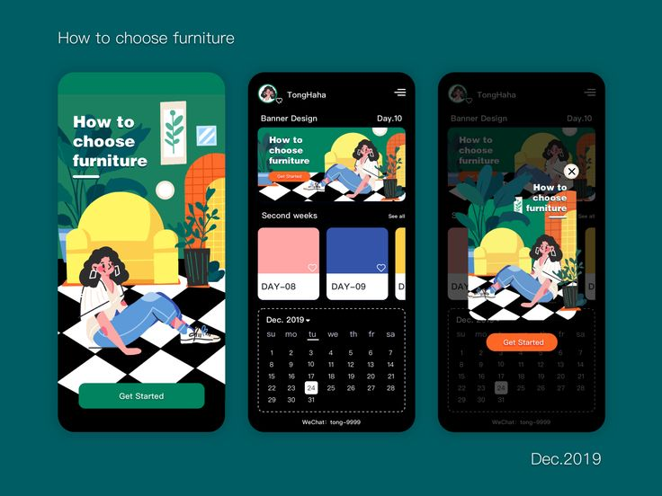

# The BookNook

#### The BookNook: The ultimate space for book lovers to track everything — from five-star reads to Kindle Unlimited picks and beyond!

## Description
As an avid reader, I love tracking what I’m reading and what I hope to read next. Part of the fun is seeing how long it takes me to finish a book, but most reading apps—especially the most popular one, Goodreads—feel outdated. I wanted a single place where I could track everything: how much I’ve spent on books this month, my progress on a ‘100 Classics’ list, and more. But beyond just tracking, I envision this app growing into a space where readers can connect—sharing recommendations, discussing their latest reads, and building a true book-loving community.

## Table of Contents
* [Technologies Used](#technologiesused)
* [Features](#features)
* [Design](#design)
* [Project Next Steps](#nextsteps)
* [Deployed App](#deployment)
* [About the Author](#author)

## Technologies Used
THE MEN STACK
* MongoDB
* Express
* EJS
* Node.js
* JavaScript
* HTML5
* CSS3

## Features
Session-based authentication ensures each user’s identity is verified, providing secure access to their personalized BookNook experience.

With full CRUD functionality, users can seamlessly manage their book collection:

* Create: Add new books to their BookNook.
* Read: Browse and view their entire collection.
* Update: Edit book details as needed.
* Delete: Remove books they no longer want in their collection.

This functionality gives users complete control over their reading tracker, making BookNook a truly customizable space for book lovers.

## Wireframe Images
HOMEPAGE

DASHBOARD

## Notion Planning
* https://furry-road-5a8.notion.site/The-BookNook-19b133426c96807cbb12dbbc2e95f724?pvs=4

## Design
Inspiration: Vibrant colors and playful illustrations that bring energy and excitement.

## Project Next Steps
#### List of Future Features
* Integrate an API to enable users to search a book database and automatically import book details.
* Sync with Goodreads to allow users to import their book lists.
* Expand book tracking features to include review sections for pacing, themes/tropes, and tone/mood.
* Implement a daily reading tracker to log pages read or time spent reading.
* Enable users to categorize books into custom reading lists.
* Track book acquisition details, including a spending log.
* Introduce an analytics section for reading habits and trends.
* Foster community engagement by displaying updates on other users' reading activity.

## Deployed Link
[Github Pages](https://ashleylaisure.github.io/Minesweeper/)

* You can view the repository:
[Github.com](https://github.com/ashleylaisure/_thebooknook.git)

## About The Author
Books have always been a passion of mine, transporting me to far-off fantasy worlds for countless hours. I love what they mean to me, and it’s exciting to see more people falling in love with reading. Many avid readers create their own tracking systems using Notion, Excel, or bullet journaling, but I want to simplify that process. My goal is to develop an app that combines the best features of existing platforms with a more intuitive and modern user interface—making it easier than ever for book lovers to track and organize their reading journey

Whether I’m diving into code or exploring new ideas, I’m driven by a love for innovation and the joy of creating experiences that others can enjoy.
    
## Works Cited:
Implemented session-based authentication using the principles from General Assembly’s MEN Stack Session Auth lecture to securely manage user sessions.

* https://pages.git.generalassemb.ly/modular-curriculum-all-courses/men-stack-session-auth/canvas-landing-pages/seb.html

Implemented CRUD functionality by applying concepts from General Assembly's MEN Stack 'Embedding Related Data - Skyrockit' Lab.

* https://pages.git.generalassemb.ly/modular-curriculum-all-courses/men-stack-embedding-related-data-skyrockit/canvas-landing-pages/seb.html

I Styled the homepage using the following YouTube tutorials as references.

* https://youtu.be/ARQgANFpwQ8
* https://youtu.be/b7gc_4TrXkg

I was able to make a Sing-In/Sing-up error message using connect-Flash package.
* https://shivlab.com/blog/set-up-flash-messages-nodejs-connect-flash/

I Styled the main Index view using the following YouTube tutorials as references.

* https://www.youtube.com/watch?v=BOF79TAIkYQ

Emoji's used were copied and pasted from the Unicode site.

* https://unicode.org/emoji/charts/full-emoji-list.html

Icons were found on Boxicons

* https://boxicons.com/?query=ey

* <a href="https://www.flaticon.com/free-icons/open-book" title="open book icons">Open book icons created by Freepik - Flaticon</a>

Manipulating the date stored in MongoDB
* https://www.prisma.io/dataguide/mongodb/working-with-dates#how-to-use-date-type-methods
